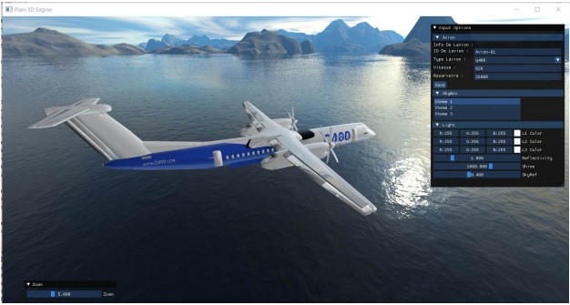
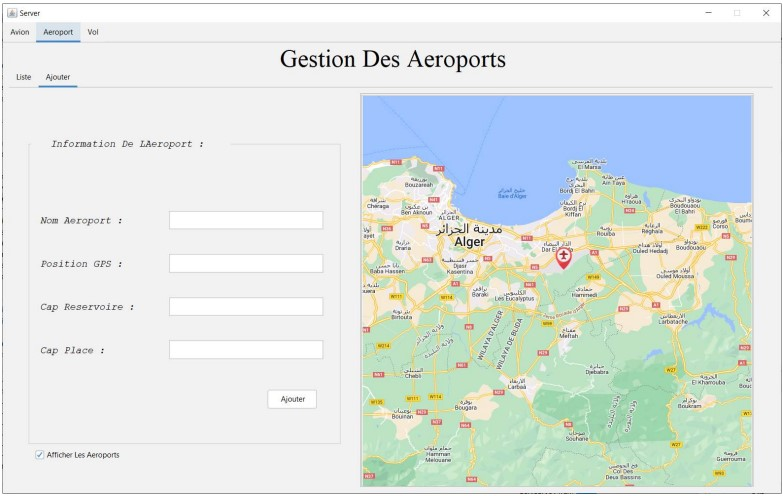
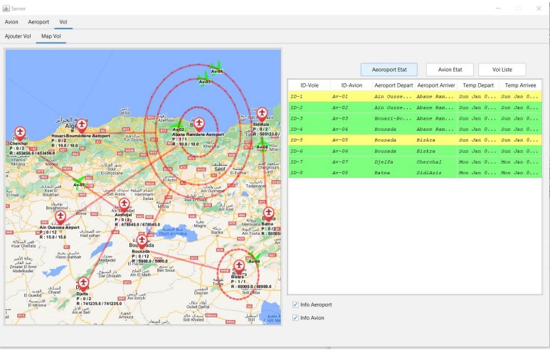

# YasmineBa-network-rmi-application-for-traffic-aeroport

La gestion de l’aéroport comprend toutes les activités nécessaires pour garantir le bon fonctionnement de l’aéroport, telles que la coordination des déplacements des voyageurs dans le monde entier, la gestion des passages, le service d’import/export, la sécurité et la planification des vols, etc. Notre travail se concentrera sur la gestion de plannification des vols.

Dans ce projet, nous avons développer une application java Client/Serveur basée sur un système réparti pour permettre la communication et l’échange d’information entre les avions(clients) et le tour de controle(serveur) du système. Nous avons examiner les méthodes mises en place pour gérer l’acheminement et de la surveillance des mouvements des avions à l’intérieur de l’espace aérien de l’aéroport, ainsi que nous avons porté des amélioration pour un meilleur résultat de fonctionnement.

